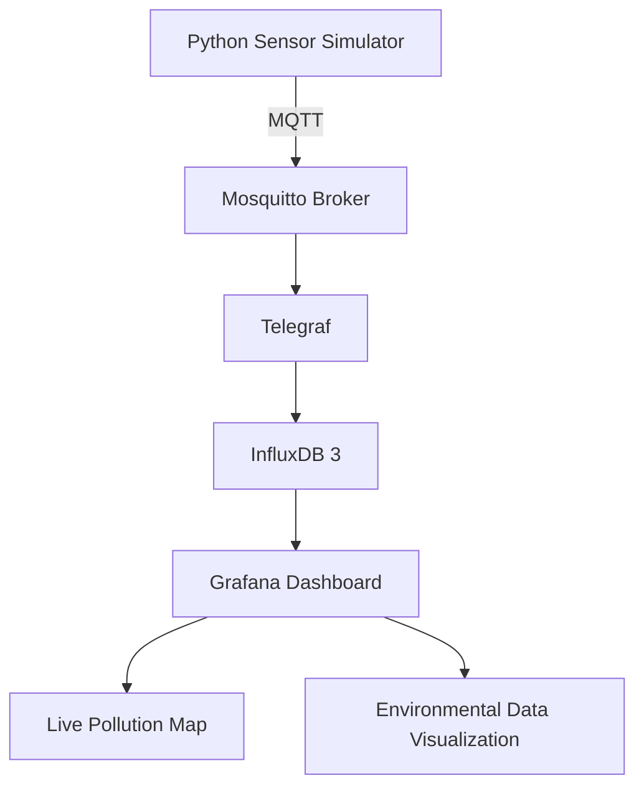

# 🌍 Urban Pollution Hotspot Detection

**A real-time IoT-based urban pollution monitoring and hotspot visualization system using MQTT, InfluxDB, Telegraf, Docker, and Grafana.**

The **Urban Pollution Hotspot Detection** project is designed to monitor environmental conditions, collect pollution-related data, and visualize potential pollution hotspots through an interactive, real-time dashboard.

The system uses a simulated sensor data pipeline that can later be extended to work with real environmental sensors and IoT hardware.

---

## 🚀 Project Overview

Urban air pollution is a growing environmental concern. Identifying areas with elevated pollution levels can help support environmental monitoring, urban planning, and data-driven decision-making.

This project demonstrates an IoT-based architecture that collects, processes, stores, and visualizes environmental data, including:

* 🌫️ **PM2.5:** Particulate matter 2.5 concentration.
* 🌫️ PM10: Particulate matter 10 concentration.
* 🏭 **CO:** Carbon monoxide readings.
* 🌡️ **Temperature:** Ambient temperature.
* 💧 **Humidity:** Relative humidity.
* 📍 **Geolocation:** Latitude and longitude for mapping pollution measurements.

The collected data is visualized using Grafana, with an interactive map to display sensor locations and potential pollution hotspots.

---

## 🏗️ System Architecture

The project follows a modular architecture in which each component performs a specific task.



### Data Flow

1. **Python Simulator:** Generates environmental sensor readings, including pollution measurements, temperature, humidity, and location.
2. **Mosquitto:** Receives and distributes sensor messages using the MQTT protocol.
3. **Telegraf:** Subscribes to MQTT topics, processes incoming data, and forwards it to the database.
4. **InfluxDB 3:** Stores time-series environmental measurements.
5. **Grafana:** Queries the stored data and presents it through a real-time monitoring dashboard.
6. **Pollution Map:** Displays geolocated readings to help visualize pollution distribution.

---

## 🛠️ Technologies Used

| Technology                | Purpose                                   |
| ------------------------- | ----------------------------------------- |
| Python                    | Sensor data simulation                    |
| MQTT                      | Lightweight messaging protocol            |
| Eclipse Mosquitto         | MQTT broker                               |
| Telegraf                  | Data collection and processing            |
| InfluxDB 3 Core           | Time-series database                      |
| Grafana                   | Dashboard and visualization               |
| Docker                    | Containerization                          |
| Docker Compose            | Multi-container orchestration             |
| JSON                      | Data exchange and dashboard configuration |
| Geo-spatial visualization | Pollution mapping                         |

---

## 📊 Dashboard Features

The Grafana dashboard is designed to provide an intuitive view of environmental conditions.

### 🌍 Interactive Pollution Map

* Visualizes sensor locations using geographic coordinates.
* Displays pollution-related measurements on a map.
* Helps identify areas with elevated pollution readings.

### 📈 Real-Time Data Monitoring

* Continuously receives and visualizes incoming sensor readings.
* Displays environmental measurements over time.
* Supports monitoring of changing pollution conditions.

### 🌡️ Environmental Metrics

* PM2.5 concentration.
* Carbon monoxide readings.
* Temperature.
* Humidity.

### 📍 Geospatial Monitoring

* Uses latitude and longitude data to associate readings with geographic locations.
* Provides a foundation for identifying potential pollution hotspots.

---

## 📂 Project Structure

```text
Urban-Pollution-Hotspot-Detection/
│
├── grafana/
│   ├── dashboards/
│   │   └── urban-pollution.json
│   │
│   └── provisioning/
│       ├── dashboards/
│       └── datasources/
│
├── mosquitto/
│   └── config/
│
├── simulator/
│   ├── Dockerfile
│   ├── simulator.py
│   └── requirements.txt
│
├── telegraf/
│   ├── telegraf.conf
│   └── telegraf.d/
│
├── .env.example
├── .gitignore
├── docker-compose.yml
└── README.md
```

---

## 💻 Installation and Setup Guide

This guide explains how to download, configure, run, monitor, and stop the **Urban Pollution Hotspot Detection** project on a new computer using Docker Compose.

The project uses Docker to run the Python simulator, MQTT broker, Telegraf, InfluxDB 3 Core, and Grafana together.

### 🧰 1. Prerequisites

Before starting, make sure you have installed the following software.

| Software       | Purpose                         | Download                                                                   |
| -------------- | ------------------------------- | -------------------------------------------------------------------------- |
| Docker Desktop | Runs the project's containers   | [Download Docker Desktop](https://www.docker.com/products/docker-desktop/) |
| Git (optional) | Clone and manage the repository | [Download Git](https://git-scm.com/downloads)                              |
| Web browser    | Access the Grafana dashboard    | Chrome, Edge, Firefox, etc.                                                |

**System requirements:**

* Windows, Linux, or macOS with Docker support.
* An active internet connection for the initial download of container images.
* Sufficient available disk space and memory to run the services.

For Windows, install Docker Desktop and make sure its Docker engine is running.

Verify your installation by opening PowerShell or a terminal and executing:

```powershell
docker --version
```

Check the Docker Compose installation:

```powershell
docker compose version
```

Check whether Docker is running:

```powershell
docker info
```

If these commands execute successfully, proceed to the next step.

---

### 📥 2. Download the Project ZIP

You can download the project directly from GitHub without installing or using Git.

1. Open the [Urban Pollution Hotspot Detection repository](https://github.com/anish1732/Urban-Pollution-Hotspot-Detection).
2. Click the green **Code** button.
3. Select **Download ZIP**.
4. Wait for the download to complete.
5. Extract the ZIP file using Windows File Explorer or your preferred archive utility.

The extracted folder should contain files similar to:

```text
Urban-Pollution-Hotspot-Detection/
│
├── grafana/
├── mosquitto/
├── simulator/
├── telegraf/
│
├── .env.example
├── .gitignore
├── docker-compose.yml
└── README.md
```

**Important:** The `docker-compose.yml` file must be in the directory from which you execute the Docker Compose commands.

---

### 📂 3. Open the Project Directory

Open PowerShell and navigate to the extracted project folder.

For example, if the project is extracted to your Desktop:

```powershell
cd "$env:USERPROFILE\Desktop\Urban-Pollution-Hotspot-Detection"
```

If your extracted folder has a different name or location, adjust the path accordingly.

Verify the current directory:

```powershell
Get-Location
```

List the files:

```powershell
Get-ChildItem -Force
```

Check that the Docker Compose file exists:

```powershell
Test-Path .\docker-compose.yml
```

Expected output:

```text
True
```

If the output is `False`, navigate to the correct folder before continuing.

---

### ⚙️ 4. Configure Environment Variables

The project includes an `.env.example` file containing example environment variable names and placeholder values.

Create your own `.env` file.

**Windows PowerShell:**

```powershell
Copy-Item .env.example .env
```

**Linux/macOS:**

```bash
cp .env.example .env
```

Open the file using Notepad on Windows:

```powershell
notepad .env
```

Or use a terminal editor on Linux/macOS:

```bash
nano .env
```

An example configuration may look like this:

```env
INFLUXDB_TOKEN=YOUR_INFLUXDB_TOKEN
INFLUXDB_ORG=YOUR_ORG
INFLUXDB_BUCKET=iot_data
```

Replace the placeholders with the values required by your Docker Compose and InfluxDB configuration.

Save the file before proceeding.

**Security warning:**

* Do not upload your `.env` file to GitHub.
* Do not share your InfluxDB token publicly.
* Do not use another person's credentials without authorization.

If the project configuration requires an InfluxDB token to be generated during initial setup, follow the corresponding InfluxDB configuration steps before starting the complete stack.

---

### 🐳 5. Build and Start the Docker Containers

Navigate to the directory containing `docker-compose.yml`.

Validate the Compose configuration:

```powershell
docker compose config
```

This command checks the configuration and displays the resolved Compose setup. Review the output locally and avoid sharing it if it contains sensitive values.

Build the images and start the services:

```powershell
docker compose up -d --build
```

**Command explanation:**

| Command          | Description                                |
| ---------------- | ------------------------------------------ |
| `docker compose` | Runs Docker Compose commands               |
| `up`             | Creates and starts the configured services |
| `-d`             | Runs the containers in the background      |
| `--build`        | Builds or rebuilds images before starting  |

The first startup may take several minutes because Docker needs to download images and build the simulator.

For subsequent startups, use:

```powershell
docker compose up -d
```

This reuses the existing images and containers where possible.

---

### 🔍 6. Verify the Running Services

After starting the project, check the container status:

```powershell
docker compose ps
```

You should see the configured services, such as:

```text
pollution-grafana
pollution-influxdb
pollution-telegraf
pollution-mosquitto
pollution-simulator
```

The exact names and status output depend on the Compose configuration.

Check all running Docker containers:

```powershell
docker ps
```

To include stopped containers:

```powershell
docker ps -a
```

If a container is not running, inspect its logs before attempting to restart it.

---

### 📋 7. View Logs and Troubleshoot Services

Docker Compose provides several commands for inspecting the application.

**View logs from all services:**

```powershell
docker compose logs
```

**Follow live logs:**

```powershell
docker compose logs -f
```

Press `Ctrl + C` to stop following the logs. This does not stop the containers.

**View logs from a specific service:**

```powershell
docker compose logs -f simulator
```

```powershell
docker compose logs -f mosquitto
```

```powershell
docker compose logs -f telegraf
```

```powershell
docker compose logs -f influxdb
```

```powershell
docker compose logs -f grafana
```

These service names are examples. Use the actual service keys from your `docker-compose.yml` if they differ from the examples.

To display only the most recent log lines:

```powershell
docker compose logs --tail 50
```

If any service fails to start, check its logs for configuration errors, missing environment variables, authentication failures, or port conflicts.

---

### 📡 8. Verify MQTT Data

The simulator sends environmental readings to the MQTT topic:

```text
pollution/data
```

To inspect incoming messages, use the Mosquitto subscriber inside the broker container, if the required utility is available:

```powershell
docker compose exec mosquitto mosquitto_sub -h localhost -t "pollution/data" -C 5 -v
```

The command subscribes to the topic and displays up to five messages.

Example output:

```text
pollution/data {"sensor_id":"S1","lat":28.6139,"lon":77.209,"pm25":142,"co":2.58,"temperature":29,"humidity":37}
```

If no messages appear, check whether the simulator is running:

```powershell
docker compose ps
```

Then inspect its logs:

```powershell
docker compose logs --tail 50 simulator
```

The exact message format depends on the simulator implementation.

---

### 📊 9. Access the Grafana Dashboard

Once the containers are running, open your web browser.

Navigate to:

```text
http://localhost:3001
```

You should see the Grafana login page.

Log in using the credentials configured for your Grafana instance.

Open the **Urban Pollution Hotspot Detection** dashboard.

The dashboard provides visualizations of the incoming environmental readings and geographic sensor information, depending on the configured panels and available data.

If Grafana does not load, check its container status:

```powershell
docker compose ps grafana
```

Inspect the Grafana logs:

```powershell
docker compose logs --tail 50 grafana
```

You can also check whether the local port is responding:

```powershell
Test-NetConnection localhost -Port 3001
```

A successful TCP connection indicates that something is listening on the specified port. It does not by itself confirm that the dashboard is fully functional.

---

### 🔄 10. Stop and Restart the Project

You can stop and resume the project without repeating the installation process.

**Stop all services while retaining their containers:**

```powershell
docker compose stop
```

**Start the stopped services again:**

```powershell
docker compose start
```

**Restart the services:**

```powershell
docker compose restart
```

**Start the application again using the normal startup command:**

```powershell
docker compose up -d
```

For normal daily use, `docker compose up -d` and `docker compose stop` are generally sufficient.

---

### 🧹 11. Shut Down and Remove Containers

If you want to stop the project and remove its containers and Compose-created network, use:

```powershell
docker compose down
```

This normally preserves named volumes, but anonymous volumes may not be retained in the same way for later reuse.

To remove containers and their associated volumes:

```powershell
docker compose down -v
```

**Warning:** Avoid the second command unless you intentionally want to delete the associated persistent data. Depending on the volume configuration, it can remove your InfluxDB data and Grafana state.

---

### 🛠️ 12. Common Problems and Solutions

| Problem                        | Possible solution                                                   |
| ------------------------------ | ------------------------------------------------------------------- |
| Docker commands fail           | Start Docker Desktop and verify the Docker engine is running        |
| `docker-compose.yml` not found | Navigate to the correct project directory                           |
| Port 3001 already in use       | Check the process using the port or change the Grafana port mapping |
| Grafana page does not load     | Check Grafana's container status and logs                           |
| No new MQTT messages           | Check the simulator and Mosquitto logs                              |
| InfluxDB authentication error  | Verify the configured token and environment variables               |
| Dashboard has no data          | Check the data source, database configuration, and Telegraf logs    |
| Containers repeatedly restart  | Inspect service logs and verify the configuration                   |
| Docker image build fails       | Check internet access, Docker compatibility, and build dependencies |

To identify the process using port 3001 on Windows:

```powershell
netstat -ano | findstr :3001
```

The final column shows the process ID (PID). You can investigate it through Task Manager before stopping anything.

---

### 💾 13. Data Persistence

The project may use Docker volumes or host-mounted directories to retain data between restarts.

To inspect the volumes used by the running project:

```powershell
docker compose config
```

Review the `volumes` section in the output.

To list Docker volumes:

```powershell
docker volume ls
```

Persistent storage is important because removing a container should not necessarily erase the database or dashboard configuration.

For a fresh installation, the database may initially contain no historical readings. The simulator must publish data and the collection pipeline must be working before the dashboard can display new measurements.

---

### ✅ Quick Start Reference

After completing the initial setup, the following commands are the most frequently used.

**Start the project:**

```powershell
docker compose up -d
```

**Check the services:**

```powershell
docker compose ps
```

**View live logs:**

```powershell
docker compose logs -f
```

**Open the dashboard:**

```text
http://localhost:3001
```

**Stop the project:**

```powershell
docker compose stop
```

**Resume the project:**

```powershell
docker compose start
```

---

**Note:** This project is currently designed around a Docker-based local deployment. Cloud deployment, public internet access, and real sensor integration require additional configuration beyond these local installation instructions.


---

## 📡 MQTT Data Format

The simulator publishes environmental data through the MQTT topic:

```text
pollution/data
```

Example message:

```json
{
  "sensor_id": "S1",
  "lat": 28.6139,
  "lon": 77.2090,
  "pm25": 142,
  "co": 2.58,
  "temperature": 29,
  "humidity": 37
}
```

### Data Fields

| Field         | Description                 |
| ------------- | --------------------------- |
| `sensor_id`   | Unique sensor identifier    |
| `lat`         | Latitude of the sensor      |
| `lon`         | Longitude of the sensor     |
| `pm25`        | PM2.5 measurement           |
| `co`          | Carbon monoxide measurement |
| `temperature` | Ambient temperature         |
| `humidity`    | Relative humidity           |

The current simulator uses generated values for testing and demonstration. The data is not a substitute for calibrated environmental sensor measurements.

---

## 🐳 Docker Services

The project uses Docker Compose to coordinate its services.

| Service               | Responsibility                    |
| --------------------- | --------------------------------- |
| `pollution-simulator` | Generates environmental readings  |
| `pollution-mosquitto` | MQTT message broker               |
| `pollution-telegraf`  | Collects and forwards data        |
| `pollution-influxdb`  | Stores environmental data         |
| `pollution-grafana`   | Visualizes environmental readings |

All services communicate through the configured Docker network.

---

## 🔮 Future Enhancements

The project can be extended with additional features:

* 🔌 **Real Sensor Integration:** Replace simulated readings with physical IoT sensors.
* 🗺️ **Advanced Geospatial Analysis:** Use GeoPandas and spatial data processing to identify and analyze pollution hotspots.
* 🚨 **Pollution Alerts:** Introduce threshold-based notifications for elevated pollution levels.
* 📊 **Historical Analysis:** Analyze long-term pollution patterns and trends.
* 🤖 **Machine Learning:** Explore pollution prediction using historical environmental data.
* ☁️ **Cloud Deployment:** Host the monitoring dashboard and data pipeline on a cloud server.
* 🌐 **Multi-Sensor Support:** Integrate multiple sensors across different urban locations.

---

## 🔐 Security Considerations

* Keep environment files and authentication tokens out of version control.
* Avoid exposing InfluxDB and MQTT ports directly to the public internet.
* Use secure authentication for Grafana.
* Configure HTTPS for public dashboard access.
* Use appropriate network rules and access restrictions when deploying to a cloud server.

---

## 🎯 Project Objectives

* Develop a modular IoT-based environmental monitoring pipeline.
* Understand MQTT-based communication and time-series data collection.
* Integrate InfluxDB with Telegraf for environmental data storage.
* Build an interactive Grafana dashboard.
* Visualize geographically distributed pollution measurements.
* Establish a foundation for future real-world pollution monitoring.

---

## 👨‍💻 Author

**Anish Kumar**

GitHub: [anish1732](https://github.com/anish1732)

---

## 📜 License

This project is intended for educational, research, and demonstration purposes.
