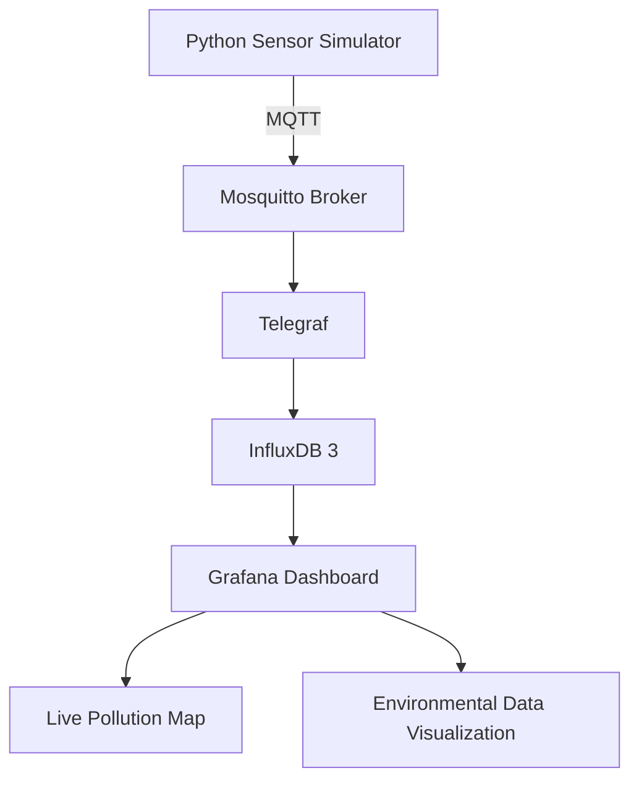

# 🌍 Urban Pollution Hotspot Detection

**A real-time IoT-based urban pollution monitoring and hotspot visualization system using MQTT, InfluxDB, Telegraf, Docker, and Grafana.**

The **Urban Pollution Hotspot Detection** project is designed to monitor environmental conditions, collect pollution-related data, and visualize potential pollution hotspots through an interactive, real-time dashboard.

The system uses a simulated sensor data pipeline that can later be extended to work with real environmental sensors and IoT hardware.

---

## 🚀 Project Overview

Urban air pollution is a growing environmental concern. Identifying areas with elevated pollution levels can help support environmental monitoring, urban planning, and data-driven decision-making.

This project demonstrates an IoT-based architecture that collects, processes, stores, and visualizes environmental data, including:

* 🌫️ **PM2.5:** Particulate matter 2.5 concentration.
* 🌫️ PM10: Particulate matter 10 concentration.
* 🏭 **CO:** Carbon monoxide readings.
* 🌡️ **Temperature:** Ambient temperature.
* 💧 **Humidity:** Relative humidity.
* 📍 **Geolocation:** Latitude and longitude for mapping pollution measurements.

The collected data is visualized using Grafana, with an interactive map to display sensor locations and potential pollution hotspots.

---

## 🏗️ System Architecture

The project follows a modular architecture in which each component performs a specific task.



### Data Flow

1. **Python Simulator:** Generates environmental sensor readings, including pollution measurements, temperature, humidity, and location.
2. **Mosquitto:** Receives and distributes sensor messages using the MQTT protocol.
3. **Telegraf:** Subscribes to MQTT topics, processes incoming data, and forwards it to the database.
4. **InfluxDB 3:** Stores time-series environmental measurements.
5. **Grafana:** Queries the stored data and presents it through a real-time monitoring dashboard.
6. **Pollution Map:** Displays geolocated readings to help visualize pollution distribution.

---

## 🛠️ Technologies Used

| Technology                | Purpose                                   |
| ------------------------- | ----------------------------------------- |
| Python                    | Sensor data simulation                    |
| MQTT                      | Lightweight messaging protocol            |
| Eclipse Mosquitto         | MQTT broker                               |
| Telegraf                  | Data collection and processing            |
| InfluxDB 3 Core           | Time-series database                      |
| Grafana                   | Dashboard and visualization               |
| Docker                    | Containerization                          |
| Docker Compose            | Multi-container orchestration             |
| JSON                      | Data exchange and dashboard configuration |
| Geo-spatial visualization | Pollution mapping                         |

---

## 📊 Dashboard Features

The Grafana dashboard is designed to provide an intuitive view of environmental conditions.

### 🌍 Interactive Pollution Map

* Visualizes sensor locations using geographic coordinates.
* Displays pollution-related measurements on a map.
* Helps identify areas with elevated pollution readings.

### 📈 Real-Time Data Monitoring

* Continuously receives and visualizes incoming sensor readings.
* Displays environmental measurements over time.
* Supports monitoring of changing pollution conditions.

### 🌡️ Environmental Metrics

* PM2.5 concentration.
* Carbon monoxide readings.
* Temperature.
* Humidity.

### 📍 Geospatial Monitoring

* Uses latitude and longitude data to associate readings with geographic locations.
* Provides a foundation for identifying potential pollution hotspots.

---

## 📂 Project Structure

```text
Urban-Pollution-Hotspot-Detection/
│
├── grafana/
│   ├── dashboards/
│   │   └── urban-pollution.json
│   │
│   └── provisioning/
│       ├── dashboards/
│       └── datasources/
│
├── mosquitto/
│   └── config/
│
├── simulator/
│   ├── Dockerfile
│   ├── simulator.py
│   └── requirements.txt
│
├── telegraf/
│   ├── telegraf.conf
│   └── telegraf.d/
│
├── .env.example
├── .gitignore
├── docker-compose.yml
└── README.md
```

---

## ⚙️ Installation and Setup

### Prerequisites

Install the following tools before starting:

* [Docker Desktop](https://www.docker.com/products/docker-desktop/)
* [Git](https://git-scm.com/)
* A Windows, Linux, or macOS environment that supports Docker

### 1. Clone the Repository

```bash
git clone https://github.com/anish1732/Urban-Pollution-Hotspot-Detection.git
```

Navigate to the project directory:

```bash
cd Urban-Pollution-Hotspot-Detection
```

### 2. Configure Environment Variables

Create a `.env` file using the provided example.

On Windows PowerShell:

```powershell
Copy-Item .env.example .env
```

Open `.env` and enter the appropriate configuration values.

```env
INFLUXDB_TOKEN=YOUR_INFLUXDB_TOKEN
INFLUXDB_ORG=YOUR_ORG
INFLUXDB_BUCKET=iot_data
```

Use your own credentials and keep the `.env` file private. Never commit access tokens or passwords to GitHub.

### 3. Start the Application

Start all services using Docker Compose:

```bash
docker compose up -d --build
```

Check the running containers:

```bash
docker compose ps
```

### 4. Access Grafana

Open Grafana in your browser:

```text
http://localhost:3001
```

Log in using the credentials configured for your Grafana instance.

Open the provisioned **Urban Pollution Hotspot Detection** dashboard to view the environmental monitoring visualizations.

> Note: Service ports, credentials, and initial setup requirements depend on your local Docker Compose configuration.

---

## 📡 MQTT Data Format

The simulator publishes environmental data through the MQTT topic:

```text
pollution/data
```

Example message:

```json
{
  "sensor_id": "S1",
  "lat": 28.6139,
  "lon": 77.2090,
  "pm25": 142,
  "co": 2.58,
  "temperature": 29,
  "humidity": 37
}
```

### Data Fields

| Field         | Description                 |
| ------------- | --------------------------- |
| `sensor_id`   | Unique sensor identifier    |
| `lat`         | Latitude of the sensor      |
| `lon`         | Longitude of the sensor     |
| `pm25`        | PM2.5 measurement           |
| `co`          | Carbon monoxide measurement |
| `temperature` | Ambient temperature         |
| `humidity`    | Relative humidity           |

The current simulator uses generated values for testing and demonstration. The data is not a substitute for calibrated environmental sensor measurements.

---

## 🐳 Docker Services

The project uses Docker Compose to coordinate its services.

| Service               | Responsibility                    |
| --------------------- | --------------------------------- |
| `pollution-simulator` | Generates environmental readings  |
| `pollution-mosquitto` | MQTT message broker               |
| `pollution-telegraf`  | Collects and forwards data        |
| `pollution-influxdb`  | Stores environmental data         |
| `pollution-grafana`   | Visualizes environmental readings |

All services communicate through the configured Docker network.

---

## 🔮 Future Enhancements

The project can be extended with additional features:

* 🔌 **Real Sensor Integration:** Replace simulated readings with physical IoT sensors.
* 🗺️ **Advanced Geospatial Analysis:** Use GeoPandas and spatial data processing to identify and analyze pollution hotspots.
* 🚨 **Pollution Alerts:** Introduce threshold-based notifications for elevated pollution levels.
* 📊 **Historical Analysis:** Analyze long-term pollution patterns and trends.
* 🤖 **Machine Learning:** Explore pollution prediction using historical environmental data.
* ☁️ **Cloud Deployment:** Host the monitoring dashboard and data pipeline on a cloud server.
* 🌐 **Multi-Sensor Support:** Integrate multiple sensors across different urban locations.

---

## 🔐 Security Considerations

* Keep environment files and authentication tokens out of version control.
* Avoid exposing InfluxDB and MQTT ports directly to the public internet.
* Use secure authentication for Grafana.
* Configure HTTPS for public dashboard access.
* Use appropriate network rules and access restrictions when deploying to a cloud server.

---

## 🎯 Project Objectives

* Develop a modular IoT-based environmental monitoring pipeline.
* Understand MQTT-based communication and time-series data collection.
* Integrate InfluxDB with Telegraf for environmental data storage.
* Build an interactive Grafana dashboard.
* Visualize geographically distributed pollution measurements.
* Establish a foundation for future real-world pollution monitoring.

---

## 👨‍💻 Author

**Anish Kumar**

GitHub: [anish1732](https://github.com/anish1732)

---

## 📜 License

This project is intended for educational, research, and demonstration purposes.
